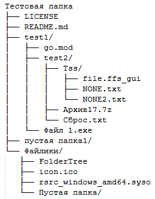
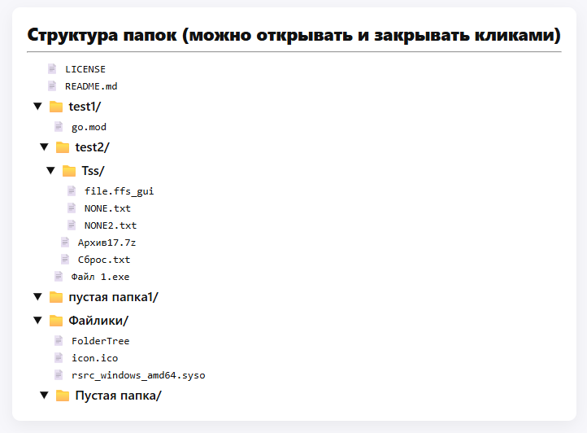

**FolderTree** - простая, кроссплатформенная программа, позволяющая создать наглядную структуру папок и файлов в Linux или Windows в TXT, MD и HTML.
 

Язык: _Go_

Версия языка Go: _1.25.3_

_\_Проект полностью открытый и бесплатный, распространяется по лицензии MIT.\__

Ссылки на [GitFlic](https://gitflic.ru/project/otto/foldertree) и [GitHub](https://github.com/Otto17/FolderTree).

---

**Использование:**

Перетащить папку на исполняемый файл, либо указать в командной строке как аргумент: "**FolderTree /home/test**" (в Windows: "**FolderTree D:\test\Тестовая папка**").

Рядом с бинарным файлом "FolderTree" создастся 3 варианта файла (для разных сценариев использования):

* [x] "**Древо папок.txt**" - текстовая структура дерева папок, подпапок и файлов.
* [x] "**Древо папок (Markdown).md**" - Markdown структура дерева папок, подпапок и файлов.
* [x] "**Древо папок (WEB).html**" - WEB структура дерева папок, подпапок и файлов.

 

`P.S. В Linux нужно сделать первым делом файл исполняемым "chmod +x FolderTree".`

---

**Пример TXT:**

---

**Пример Markdown:**

📁 **Тестовая папка**

* 📄 LICENSE

* 📄 README.md

* 📁 **test1**

  * 📄 go.mod

  * 📁 **test2**

    * 📁 **Tss**

      * 📄 file.ffs\_gui
      * 📄 NONE.txt
      * 📄 NONE2.txt

    * 📄 Архив17.7z

    * 📄 Сброс.txt

  * 📄 Файл 1.exe

* 📁 **пустая папка1**

* 📁 **Файлики**

  * 📄 FolderTree
  * 📄 icon.ico
  * 📄 rsrc\_windows\_amd64.syso
  * 📁 **Пустая папка**

---

**Пример WEB:**

---

**Автор Otto, г. Омск 2025**